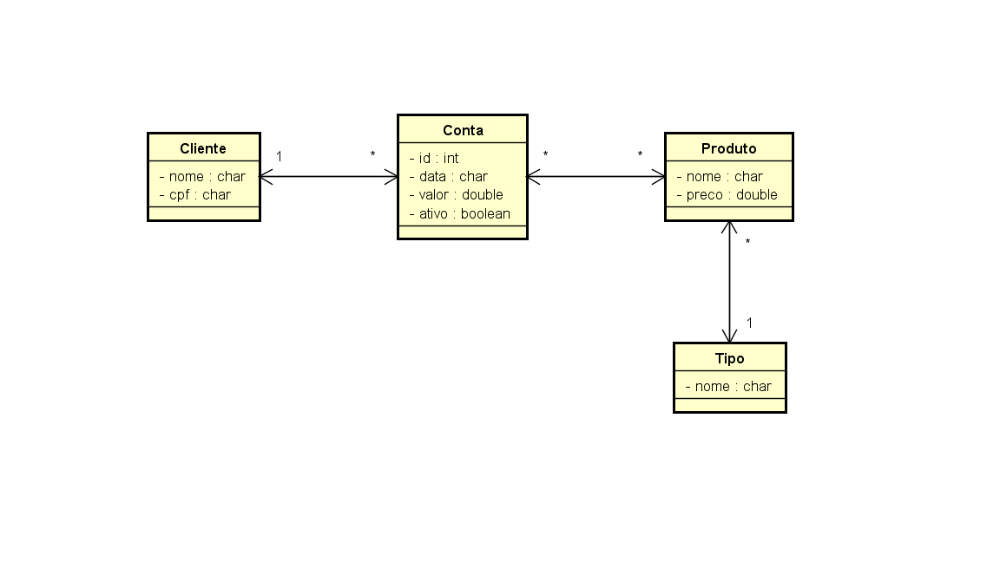

# Projeto da disciplina de Persistência de Objetos do Curso Superior de Tecnologia em Sistemas para Internet do IFPB

## Objetivo
Praticar os conceitos de persistência de objetos em Java, através do desenvolvimento de um sistema de informação, contendo aplicações para criar, recuperar, listar, alterar, indexar, excluir e consultar objetos no banco de dados orientado a objetos Db4o (projeto 1), no banco de dados relacional PostgreSQL (projeto 2) com JPA e no banco de dados MongoDB com JPA (projeto 3).

## Modelagem
O tema escolhido para o projeto foi um restaurante fictício, considere o seguinte diagrama para o sistema do restaurante:

## Implementação
O projeto está organizado nos 5 pacotes:
* **aplicacaoConsole:** uma classe com chamadas a classe Fachada para testar as funcionalidades de cadastrar, atualizar, deletar, consultar e listar;
* **aplicacaoSwing:** contém a interface gráfica do sistema, todas as telas foram feitas usando a API Swing do Java;
* **aplicacaoDesempenho:** uma aplicação console para testar o desempenho do sistema no que diz respeito ao cadastro e listagem de 1000 objetos;
* **fachada:** contém a classe Fachada com as regras de negócio e uso de DAO;
* **modelo:** contém as classes de negócio do sistema;
* **dao:** contém classes (padrão DAO) para conexão e acesso ao banco de dados (local ou remoto).